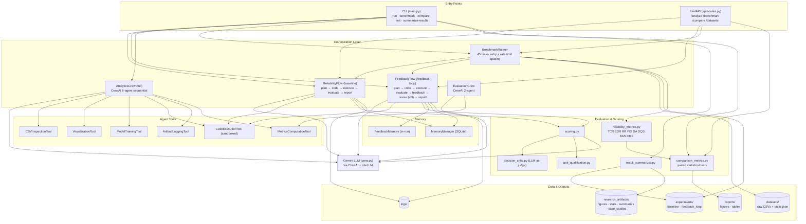
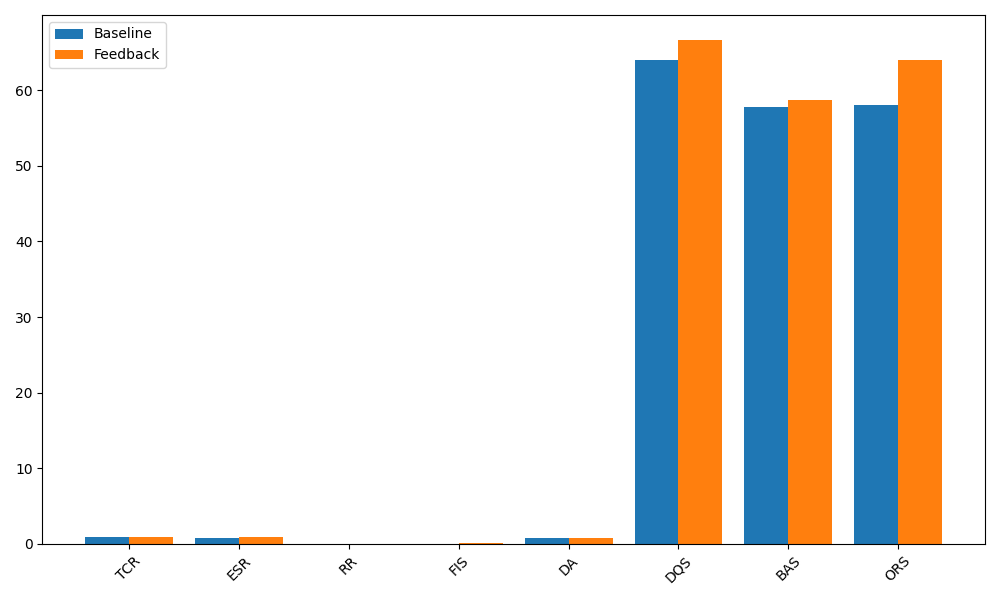

# Research Agent Benchmark

**Evaluating Reliable LLM-Based Data Science Agents with Structured Feedback Loops**

A research framework that benchmarks whether giving an LLM data-science agent a *structured, iterative feedback loop* (plan → code → execute → evaluate → feedback → revise → report) produces more reliable, higher-quality analyses than a single-pass ("baseline") agent - across 45 real-world data science tasks, six datasets, and eight reliability/decision-quality metrics.

[](LICENSE)


---

## Table of Contents

- [Overview](#overview)
- [Architecture](#architecture)
- [Repository Structure](#repository-structure)
- [How It Works](#how-it-works)
  - [Baseline flow](#baseline-flow-reliabilityflow)
  - [Feedback-loop flow](#feedback-loop-flow-feedbackflow)
  - [Full multi-agent crew](#full-multi-agent-crew-analyticscrew)
- [Reliability & Decision-Quality Metrics](#reliability--decision-quality-metrics)
- [Results](#results)
  - [Aggregate results](#aggregate-results)
  - [Case studies](#case-studies)
- [Datasets & Benchmark Tasks](#datasets--benchmark-tasks)
- [Installation](#installation)
- [Usage](#usage)
  - [CLI](#cli)
  - [API](#api)
- [Configuration](#configuration)
- [Testing](#testing)
- [License](#license)

---

## Overview

Data science tasks handed to an LLM agent - "clean this data, engineer features, train a model, tell me if I should ship it" - routinely fail silently: the code runs but answers the wrong question, a model is evaluated with the wrong metric, or a business recommendation isn't supported by the analysis. This project treats that failure mode as a research question rather than a bug to patch ad hoc.

It implements **two execution modes** over the same tasks and datasets:

| Mode | Description |
|---|---|
| **Baseline** (`ReliabilityFlow`) | A single pass: plan → generate code → execute → evaluate → report. No self-correction. |
| **Feedback loop** (`FeedbackFlow`) | The same pipeline, but execution is scored by an LLM-as-judge **Decision Critic**, structured feedback is generated, and the agent **revises and re-executes** for up to `MAX_FEEDBACK_ITERATIONS` rounds before reporting. |

Every run - baseline and feedback-loop - is scored on the same eight metrics (TCR, ESR, RR, FIS, DA, DQS, BAS, ORS; see [below](#reliability--decision-quality-metrics)), logged to SQLite and JSON, and then aggregated into paired statistical comparisons (t-tests, Wilcoxon, Cohen's d, 95% CIs) to answer: **does the feedback loop meaningfully improve reliability and decision quality, and by how much?**

A third mode, **`AnalyticsCrew`**, wires the same stages into a full six-agent [CrewAI](https://github.com/crewAIInc/crewAI) sequential crew (Planner → Coder → Executor → Evaluator → Feedback → Reporter) for interactive, single-query use outside the benchmark harness.

---

## Architecture

The system is organized into five layers:

1. **Entry points** - a CLI (`main.py`) and a FastAPI service (`api/routes.py`) exposing `/analyze`, `/benchmark`, `/compare`, and `/datasets`.
2. **Orchestration** - `ReliabilityFlow` and `FeedbackFlow` (hand-rolled orchestration loops) and `AnalyticsCrew` / `EvaluationCrew` (CrewAI-managed multi-agent crews), all driven by `BenchmarkRunner` for suite-level execution over `datasets/benchmark_tasks/tasks.json`.
3. **Agent tools** - sandboxed building blocks agents call: CSV inspection, code execution, visualization, model training, artifact logging, and metrics computation.
4. **Evaluation & scoring** - `scoring.py` orchestrates `decision_critic.py` (LLM-as-judge over 8 weighted decision dimensions) and `task_qualification.py` (pass/fail gating), rolled up by `reliability_metrics.py`, `comparison_metrics.py`, and `result_summarizer.py`.
5. **Memory & storage** - an in-run `FeedbackMemory`, a SQLite-backed `MemoryManager` for cross-run history, and on-disk artifacts under `logs/`, `experiments/`, `reports/`, and `research_artifacts/`.

<!-- A Mermaid version of the same diagram : -->



---

## Repository Structure

```
research-agent-benchmark/
├── src/research_agent/
│   ├── main.py                       # CLI entry point (run, benchmark, compare, init, summarize-results)
│   ├── crew.py                       # Central Gemini LLM configuration
│   ├── api/
│   │   └── routes.py                 # FastAPI service
│   ├── crews/
│   │   ├── analytics_crew/           # Full 6-agent CrewAI crew (planner→coder→executor→evaluator→feedback→reporter)
│   │   └── evaluation_crew/          # 2-agent crew for benchmark evaluation & experiment comparison
│   ├── flows/
│   │   ├── reliability_flow.py       # Baseline single-pass flow
│   │   └── feedback_flow.py          # Iterative feedback-loop flow
│   ├── evaluation/
│   │   ├── benchmark_runner.py       # Runs the full task suite in a given mode
│   │   ├── scoring.py                # Per-run evaluation entry point
│   │   ├── decision_critic.py        # LLM-as-judge decision-quality scoring (8 weighted dimensions)
│   │   ├── task_qualification.py     # Pass/fail qualification gating
│   │   ├── reliability_metrics.py    # TCR / ESR / RR / FIS / DA / DQS / BAS / ORS
│   │   ├── comparison_metrics.py     # Baseline vs feedback-loop statistical comparison
│   │   ├── result_summarizer.py      # Aggregates experiments → research_artifacts/
│   │   └── qualitative_evaluator.py
│   ├── memory/
│   │   ├── feedback_memory.py        # In-run feedback history
│   │   └── memory_manager.py         # SQLite-backed run history
│   ├── models/
│   │   ├── request_schema.py         # CLI/API request models
│   │   └── result_schema.py          # Run, execution, evaluation, feedback models
│   ├── tools/                        # CrewAI tool implementations
│   │   ├── csv_tool.py
│   │   ├── execution_tool.py         # Sandboxed subprocess execution with blocked-pattern guard
│   │   ├── visualization_tool.py
│   │   ├── model_tool.py
│   │   ├── logging_tool.py
│   │   └── metrics_tool.py
│   └── utils/                        # codegen, file handling, logging, retry, helpers
├── datasets/
│   ├── DATASETS.md                   # Source table for 6 real-world CSVs
│   ├── raw/                          # Downloaded datasets (via scripts/download_datasets.py)
│   ├── processed/
│   └── benchmark_tasks/tasks.json    # 45 benchmark tasks (easy → expert)
├── prompts/                          # planner / code / evaluator / feedback / report prompt templates
├── scripts/
│   ├── download_datasets.py
│   └── generate_datasets.py
├── experiments/
│   ├── baseline/                     # benchmark_*.json per baseline run
│   ├── feedback_loop/                # benchmark_*.json per feedback-loop run
│   └── results/experiments.db        # SQLite experiment tracking
├── logs/
│   ├── agent_logs/ · execution_logs/ · feedback_logs/
├── reports/
│   ├── figures/ · tables/ · paper_draft/
├── research_artifacts/
│   ├── figures/                      # Aggregate bar/line charts
│   ├── statistics/                   # Per-task statistics CSVs
│   ├── summaries/                    # benchmark_summary.md, overall_metrics.csv, statistical_analysis.md
│   └── case_studies/                 # Highest/lowest-delta task deep dives with radar charts
├── docs/
│   └── architecture_diagram.png      # Rendered architecture diagram (Graphviz source: architecture.dot)
├── tests/                            # pytest suite (agents, evaluation, tools)
├── pyproject.toml
└── .env.example
```

---

## How It Works

### Baseline flow (`ReliabilityFlow`)

A single-pass pipeline with no self-correction:

`plan → generate code → execute (sandboxed subprocess) → evaluate (Decision Critic + qualification) → report`

Used as the control condition - this is what a naive one-shot LLM data-science agent looks like.

### Feedback-loop flow (`FeedbackFlow`)

The research condition. Same pipeline, wrapped in a bounded revision loop:

`plan → [generate code → execute → evaluate → structured feedback → revise] × up to MAX_FEEDBACK_ITERATIONS → report`

- Every iteration's code, execution result, and feedback are persisted to `logs/feedback_logs/`.
- `FeedbackMemory` folds prior iterations' feedback into the next code-generation prompt (`feedback_context`).
- The loop exits early once `StructuredFeedback.passed` is `True`, or after the iteration cap is reached.
- Recovery is tracked explicitly: a task that fails on iteration 0 and succeeds on a later iteration is flagged `recovered_from_failure`, feeding the **Recovery Rate (RR)** metric.

### Full multi-agent crew (`AnalyticsCrew`)

For interactive/exploratory use (not the benchmark harness), the same stages are implemented as a **CrewAI sequential process** with six distinct agents - Data Science Planner, Python Code Generator, Code Executor, Analysis Evaluator, Structured Feedback Generator, Research Report Writer - each with its own role, tools, and prompt, defined declaratively in `crews/analytics_crew/config/{agents,tasks}.yaml`.

A parallel two-agent **`EvaluationCrew`** (Benchmark Evaluator → Metrics Analyst) is used to narrate benchmark results and experiment comparisons in natural language.

---

## Reliability & Decision-Quality Metrics

Computed per-run in `reliability_metrics.py` and aggregated in `comparison_metrics.py`:

| Metric | Name | What it measures |
|---|---|---|
| **TCR** | Task Completion Rate | Did the evaluator judge the task as completed (score ≥ 0.7 or successful execution)? |
| **ESR** | Execution Success Rate | Did the generated code execute without error? |
| **RR** | Recovery Rate | Of tasks that failed initially, what fraction recovered by the final iteration? |
| **FIS** | Feedback Improvement Score | Score delta between the last two feedback iterations. |
| **DA** | Decision Accuracy | Mean normalized score across core decision-critic dimensions. |
| **DQS** | Decision Quality Score | Weighted (0–100) blend of 8 decision-critic dimensions (data understanding, preprocessing, feature engineering, model selection, evaluation strategy, statistical validity, explainability, business alignment). |
| **BAS** | Business Alignment Score | Business-alignment dimension of the decision critic, scaled 0–100. |
| **ORS** | Overall Reliability Score | Weighted composite of all of the above (0–100), the headline research metric. |

The **Decision Critic** (`decision_critic.py`) is an LLM-as-judge that scores each of the 8 decision dimensions 0–10 with a confidence score, independent of whether the code merely *ran* - this is what separates "the script executed" from "the recommendation was sound."

Statistical comparisons between baseline and feedback-loop runs (`comparison_metrics.py`, `statistical_analysis.md`) use paired t-tests, Wilcoxon signed-rank tests, Cohen's d effect sizes, and 95% confidence intervals on the mean difference per metric.

---

## Results

Results below are generated by `research-agent summarize-results` from the paired baseline/feedback-loop runs in `experiments/`, over 32 completed benchmark tasks.

### Aggregate results

| Metric | Baseline Mean | Feedback Mean | Mean Δ | Improvement % |
|---|---|---|---|---|
| TCR | 0.9062 | 0.9375 | +0.0312 | 3.45% |
| ESR | 0.8125 | 0.9375 | +0.1250 | 15.38% |
| RR  | 0.0000 | 0.0000 | 0.0000 | 0.00% |
| FIS | 0.0000 | 0.0538 | +0.0538 | — |
| DA  | 0.7922 | 0.7987 | +0.0065 | 0.82% |
| DQS | 64.03  | 66.63  | +2.60  | 4.06% |
| BAS | 57.75  | 58.75  | +1.00  | 1.73% |
| **ORS** | **58.07** | **63.99** | **+5.92** | **10.19%** |

Full BreakDown : [`research_artifacts/statistics/benchmark_statistics.csv`](research_artifacts/statistics/benchmark_statistics.csv)

Statistical significance details : [`research_artifacts/summaries/statistical_analysis.md`](research_artifacts/summaries/statistical_analysis.md)

Full source data: 
[`research_artifacts/summaries/overall_metrics.csv`](research_artifacts/summaries/overall_metrics.csv), 
[`research_artifacts/summaries/benchmark_summary.md`](research_artifacts/summaries/benchmark_summary.md)


<!-- PLACEHOLDER: aggregate metrics bar chart -->


<!-- PLACEHOLDER: aggregate metrics line chart -->
[Overall Metrics - Baseline vs Feedback Line Chart](./research_artifacts/figures/overall_metrics_line_chart.png)

Notably, the Decision Quality Score improvement (Cohen's d = 0.82) and Overall Reliability Score improvement (p = 0.015) are the two statistically strongest effects - the feedback loop's biggest impact is on the *quality of the analytical decision*, not just whether code ran.

### Case studies

`research_artifacts/case_studies/` contains deep dives into the most informative individual tasks, each with a metrics table, a per-dimension decision breakdown, and a radar chart comparing baseline vs feedback-loop decision quality:

| Case study | Task | Highlight |
|---|---|---|
| `highest_ors_improvement/` | task_036 | Largest Overall Reliability Score gain (+33.4) |
| `highest_dqs_improvement/` | task_029 | Largest Decision Quality Score gain (+11.5) |
| `highest_fis_improvement/` | task_029 | Largest single-run Feedback Improvement Score gain |
| `largest_degradation/` | task_030 | The one task where the feedback loop performed worse (−5.85 ORS) - included for honesty, not just headline wins |

<!-- PLACEHOLDER: case study radar chart (highest ORS improvement, task_036) -->
[Decision Quality Radar - task_036 (highest ORS improvement)](./research_artifacts/case_studies/highest_ors_improvement/decision_quality_radar.png)

---

## Datasets & Benchmark Tasks

Six public, real-world datasets (≥1,500 rows each), listed in [`datasets/DATASETS.md`](datasets/DATASETS.md):

| Dataset | Rows | Source |
|---|---|---|
| Telco Customer Churn | 7,043 | IBM / Kaggle |
| Bank Marketing | 41,188 | UCI |
| California Housing | 20,640 | 1990 census |
| Adult Income (Census) | 32,561 | UCI |
| Credit Card Default | 30,000 | UCI |
| Online Shoppers Purchasing Intention | 12,330 | UCI |

45 benchmark tasks span `easy → medium → hard → expert` difficulty and `eda / preprocessing / modeling / visualization` categories, defined in [`datasets/benchmark_tasks/tasks.json`](datasets/benchmark_tasks/tasks.json), e.g.:

```json
{
  "id": "task_001",
  "category": "eda",
  "difficulty": "easy",
  "dataset": "datasets/raw/telco_customer_churn.csv",
  "target_column": "Churn",
  "query": "Perform EDA on the telco churn dataset: print shape, column dtypes, missing value counts per column, and overall churn rate (percentage of Churn=Yes).",
  "expected_outputs": ["stdout summary"]
}
```

Datasets are fetched with `python scripts/download_datasets.py` (or `research-agent init`), or manually per the source links in `DATASETS.md`.

---

## Installation

Requires Python ≥ 3.11 and a [Gemini API key](https://aistudio.google.com/apikey).

```bash
git clone https://github.com/Asif-Ali-13/research-agent-benchmark.git
cd research-agent-benchmark

pip install -e .
# or, for development (pytest, ruff):
pip install -e ".[dev]"

cp .env.example .env
# then edit .env and set GEMINI_API_KEY / GOOGLE_API_KEY

research-agent init          # creates directories, downloads datasets
```

---

## Usage

### CLI

```bash
# Run a single analytics task
research-agent run --query "Predict churn and report top 3 drivers" \
    --dataset datasets/raw/telco_customer_churn.csv --mode feedback

# Run the full 45-task benchmark suite in feedback-loop mode
research-agent benchmark --mode feedback_loop

# Run only the baseline mode, limited to 5 tasks
research-agent benchmark --mode baseline --limit 5

# Compare baseline vs feedback-loop metrics across all paired runs
research-agent compare --final

# Compare a specific task across modes
research-agent compare --task-id task_036

# Aggregate results into research_artifacts/ (figures, stats, case studies)
research-agent summarize-results
```

### API

```bash
research-api   # starts uvicorn on API_HOST:API_PORT (default 0.0.0.0:8000)
```

```bash
curl -X POST http://localhost:8000/analyze \
  -H "Content-Type: application/json" \
  -d '{"query": "Segment customers by RFM", "dataset_path": "datasets/raw/online_shoppers.csv", "mode": "feedback"}'
```

Endpoints: `GET /health`, `POST /analyze`, `POST /benchmark`, `POST /compare`, `GET /datasets`.

---

## Configuration

Key environment variables (see [`.env.example`](.env.example) for the full list):

| Variable | Default | Purpose |
|---|---|---|
| `MODEL` | `gemini/gemini-2.5-flash` | LLM used by all agents/crews |
| `MAX_FEEDBACK_ITERATIONS` | `3` | Cap on feedback-loop revision rounds |
| `EXECUTION_TIMEOUT_SECONDS` | `120` | Sandboxed code execution timeout |
| `FEEDBACK_PASS_THRESHOLD` | `0.75` | Score above which feedback loop exits early |
| `QUALIFICATION_PASS_THRESHOLD` | `0.8` | Threshold for task qualification gating |
| `BENCHMARK_TASK_DELAY_SECONDS` | `12` | Delay between benchmark tasks (rate-limit spacing) |
| `DATABASE_URL` | `sqlite:///experiments/results/experiments.db` | Experiment tracking DB |

---

## Testing

```bash
pytest
```

Test suite covers agent construction (`tests/test_agents.py`), evaluation/scoring logic (`tests/test_evaluation.py`), and tool behavior (`tests/test_tools.py`).

---

## License

This project is licensed under the MIT License. See the [LICENSE](LICENSE) file for details.