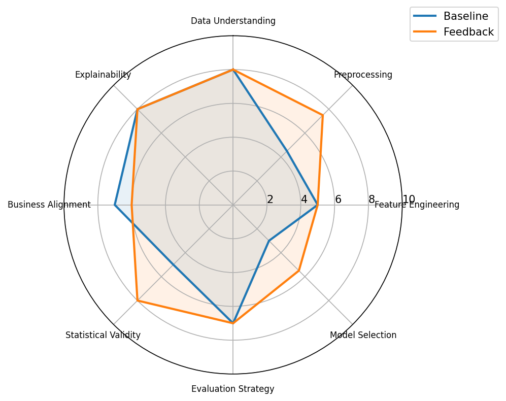

# Comparison Report for task_029

## Summary Metrics

| metric | baseline | feedback_loop | delta | improved |
| ------ | -------- | ------------- | ----- | -------- |
| TCR    | 1.0      | 1.0           | 0.0   | False    |
| ESR    | 1.0      | 1.0           | 0.0   | False    |
| RR     | 0.0      | 0.0           | 0.0   | False    |
| FIS    | 0.0      | 0.54          | 0.54  | True     |
| DA     | 1.0      | 1.0           | 0.0   | False    |
| DQS    | 54.75    | 66.25         | 11.5  | True     |
| BAS    | 70.0     | 60.0          | -10.0 | False    |
| ORS    | 71.45    | 80.35         | 8.9   | True     |

## Decision Quality Breakdown

| component            | baseline | feedback_loop | delta | improved |
| -------------------- | -------- | ------------- | ----- | -------- |
| Data Understanding   | 8.0      | 8.0           | 0.0   | False    |
| Preprocessing        | 4.5      | 7.5           | 3.0   | True     |
| Feature Engineering  | 5.0      | 5.0           | 0.0   | False    |
| Model Selection      | 3.0      | 5.5           | 2.5   | True     |
| Evaluation Strategy  | 7.0      | 7.0           | 0.0   | False    |
| Statistical Validity | 5.0      | 8.0           | 3.0   | True     |
| Business Alignment   | 7.0      | 6.0           | -1.0  | False    |
| Explainability       | 8.0      | 8.0           | 0.0   | False    |

### Highlights
- Most improved component: Preprocessing (3.0)
- Least improved component: Business Alignment (-1.0)
- Average improvement: 0.9375
- Components requiring further refinement: Data Understanding, Feature Engineering, Model Selection, Evaluation Strategy, Business Alignment, Explainability
