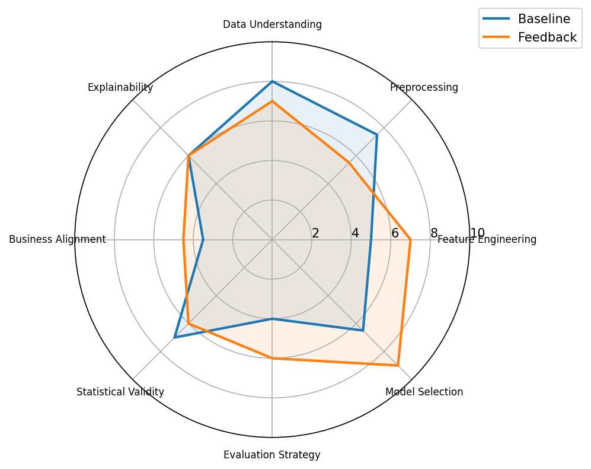

# Comparison Report for task_036

## Summary Metrics

| metric | baseline | feedback_loop | delta | improved |
| ------ | -------- | ------------- | ----- | -------- |
| TCR    | 0.0      | 1.0           | 1.0   | True     |
| ESR    | 0.0      | 1.0           | 1.0   | True     |
| RR     | 0.0      | 0.0           | 0.0   | False    |
| FIS    | 0.0      | 0.0           | 0.0   | False    |
| DA     | 0.6083   | 0.6333        | 0.025 | True     |
| DQS    | 59.25    | 66.25         | 7.0   | True     |
| BAS    | 35.0     | 45.0          | 10.0  | True     |
| ORS    | 29.27    | 62.67         | 33.4  | True     |

## Decision Quality Breakdown

| component            | baseline | feedback_loop | delta | improved |
| -------------------- | -------- | ------------- | ----- | -------- |
| Data Understanding   | 8.0      | 7.0           | -1.0  | False    |
| Preprocessing        | 7.5      | 5.5           | -2.0  | False    |
| Feature Engineering  | 5.0      | 7.0           | 2.0   | True     |
| Model Selection      | 6.5      | 9.0           | 2.5   | True     |
| Evaluation Strategy  | 4.0      | 6.0           | 2.0   | True     |
| Statistical Validity | 7.0      | 6.0           | -1.0  | False    |
| Business Alignment   | 3.5      | 4.5           | 1.0   | True     |
| Explainability       | 6.0      | 6.0           | 0.0   | False    |

## Feedback Impact Analysis

### Positive Contributions
- ✓ Feature Engineering (+2.0)
- ✓ Model Selection (+2.5)
- ✓ Evaluation Strategy (+2.0)
- ✓ Business Alignment (+1.0)

### Neutral Components
- Explainability

### Negative Contributions
- ✗ Data Understanding (-1.0)
- ✗ Preprocessing (-2.0)
- ✗ Statistical Validity (-1.0)

### Overall Interpretation
- Feedback had no net effect on the analytical decision quality profile.

### Additional Summary
- Highest scoring component: Model Selection (9.0)
- Lowest scoring component: Business Alignment (4.5)
- Largest improvement: Model Selection (2.5)
- Largest regression: Preprocessing (-2.0)
- Average improvement: 0.4375
- Components requiring further refinement: Data Understanding, Preprocessing, Evaluation Strategy, Statistical Validity, Business Alignment, Explainability
- Decision Critic Confidence: 0.82
