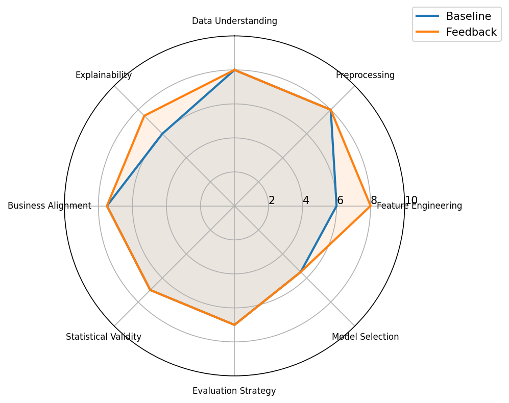

# Comparison Report for task_030

## Summary Metrics

| metric | baseline | feedback_loop | delta | improved |
| ------ | -------- | ------------- | ----- | -------- |
| TCR    | 1.0      | 1.0           | 0.0   | False    |
| ESR    | 1.0      | 1.0           | 0.0   | False    |
| RR     | 0.0      | 0.0           | 0.0   | False    |
| FIS    | 0.0      | -0.44         | -0.44 | False    |
| DA     | 0.7167   | 0.7167        | 0.0   | False    |
| DQS    | 68.0     | 71.75         | 3.75  | True     |
| BAS    | 75.0     | 75.0          | 0.0   | False    |
| ORS    | 69.18    | 63.33         | -5.85 | False    |

## Decision Quality Breakdown

| component            | baseline | feedback_loop | delta | improved |
| -------------------- | -------- | ------------- | ----- | -------- |
| Data Understanding   | 8.0      | 8.0           | 0.0   | False    |
| Preprocessing        | 8.0      | 8.0           | 0.0   | False    |
| Feature Engineering  | 6.0      | 8.0           | 2.0   | True     |
| Model Selection      | 5.5      | 5.5           | 0.0   | False    |
| Evaluation Strategy  | 7.0      | 7.0           | 0.0   | False    |
| Statistical Validity | 7.0      | 7.0           | 0.0   | False    |
| Business Alignment   | 7.5      | 7.5           | 0.0   | False    |
| Explainability       | 6.0      | 7.5           | 1.5   | True     |

## Feedback Impact Analysis

### Positive Contributions
- ✓ Feature Engineering (+2.0)
- ✓ Explainability (+1.5)

### Neutral Components
- Data Understanding, Preprocessing, Model Selection, Evaluation Strategy, Statistical Validity, Business Alignment

### Negative Contributions
- None

### Overall Interpretation
- The feedback did not improve the highest-impact analytical decisions, so the overall feedback improvement score remained negative.

### Additional Summary
- Highest scoring component: Data Understanding (8.0)
- Lowest scoring component: Model Selection (5.5)
- Largest improvement: Feature Engineering (2.0)
- Largest regression: n/a (0.0)
- Average improvement: 0.4375
- Components requiring further refinement: Data Understanding, Preprocessing, Model Selection, Evaluation Strategy, Statistical Validity, Business Alignment
- Decision Critic Confidence: 0.86
